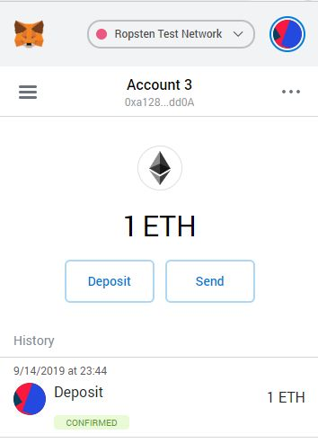
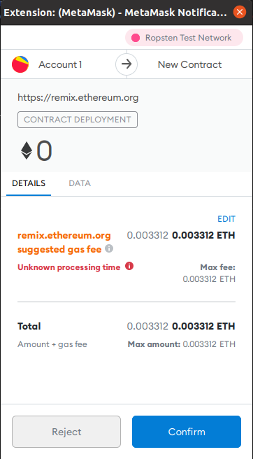

# TIC-BLK4 / Blockchain distributed system and Smart contract

[Ropsten contract address](https://ropsten.etherscan.io/tx/0xd155b3c636c5383d1c002adea8d55bf80ecb5c53abfa1753d9aedd0d90bcd8a7)

## Purpose

This Dapp allows to create an event for Olympic Games in the case of subject, but we developed it so that it can be applied for any event wich requires to sell fixed number of tickets, validate and check owner of ticket by an agent, roles such as visitor, guest, security and owner. Only agent can validate ticket, agent is set by the owner of an event.

## How To
### Deploy on Remix IDE

To deploy this smart contract on Remix WEB IDE
- first of all you have to go [here](https://remix.ethereum.org)
- replace all files by those in this repository
- compile *Ticket.sol*
- then deploy *Ticket.sol*

### Deploy on Ropsten testnet

#### From CLI : 
If you want to manage your smart contract from CLI you have to read [this](https://www.trufflesuite.com/docs/truffle/quickstart)

#### From Remix WEB IDE :
To deploy this smart contract on Ropsten from Remix WEB IDE click on [this link](https://remix.ethereum.org)

- first, you have to follow the previous step *Deploy on Remix IDE*
- download Metamask browser extension https://metamask.io/
- create wallet, connect to Ropsten testnet :

- get eth on https://faucet.ropsten.be/
- back to Remix WEB IDE
- in deploy and run transcations > environment, select *Injected Web3*
- then connect metamask to remix
- click on *Deploy*
- and confirm

